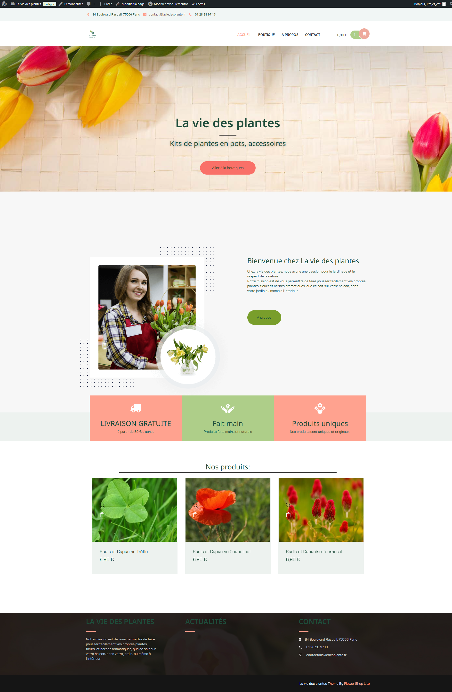
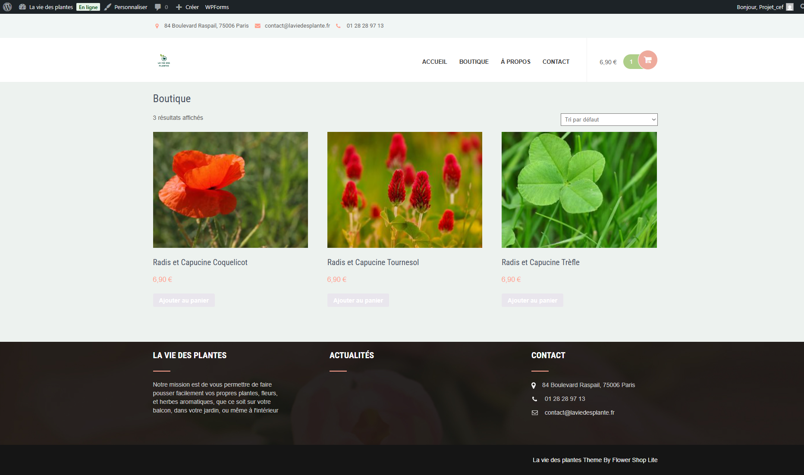
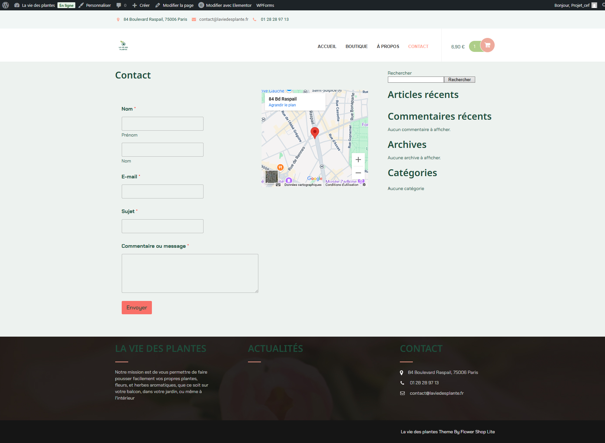
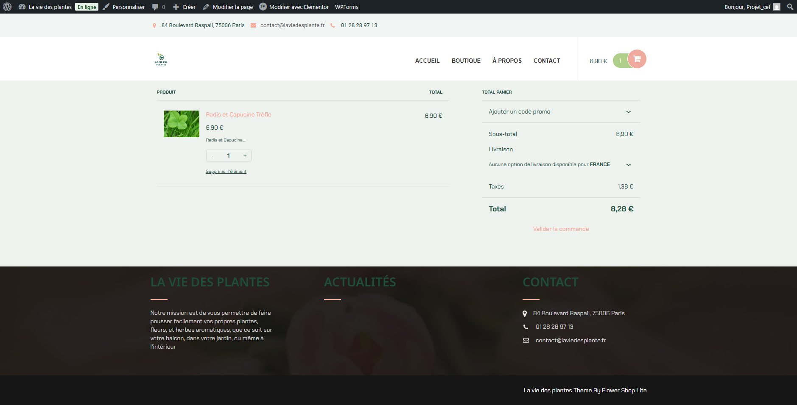
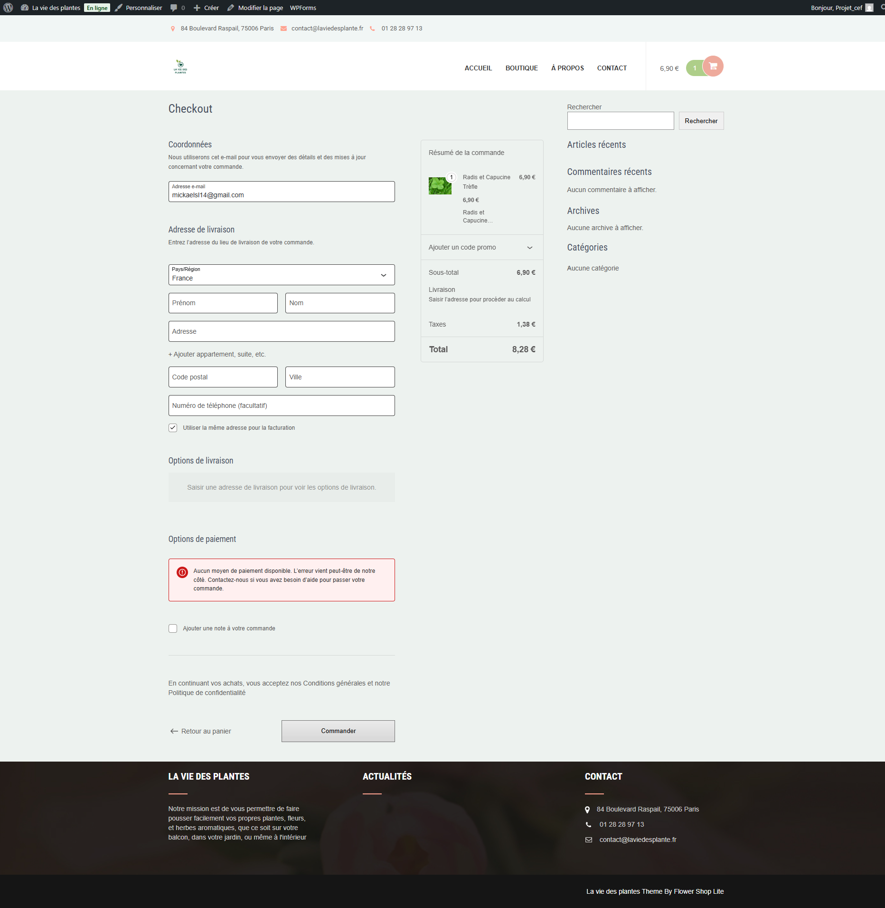

# La vie des plantes

Ce projet a été réalisé dans le cadre de la formation **CEF : Développeur Web et Web Mobile**.

Il a été développé avec **WordPress**.

## Connexion à l'administration WordPress

- **Login** : `Projet_cef`
- **Password** : `CEFMICKAEL`

## Captures d'écran

### Accueil

### Boutique

### À propos

### Contact

### Panier

### Confirmation d'achat

